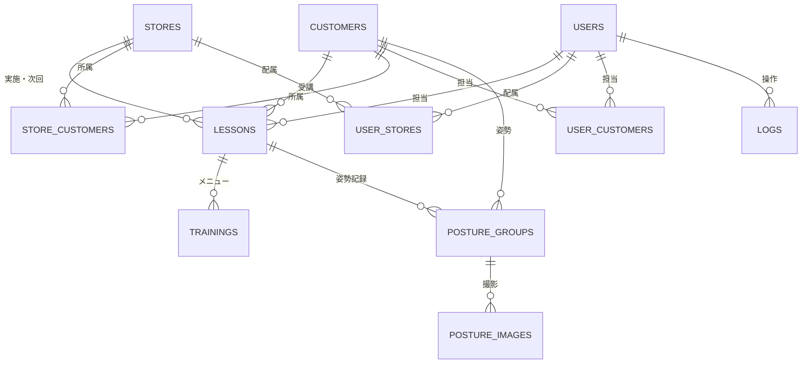

# FitnessGym MG

## プロジェクト概要


## 技術スタック
- Java 17+
- Spring Boot
- Gradle
- Thymeleaf、CSS（静的ファイル）

## ディレクトリ構成
```text
project-root/
├── build.gradle または pom.xml        # 依存関係・ビルド設定
├── gradlew / gradlew.bat              # Gradle実行スクリプト
├── settings.gradle                    # Gradle設定ファイル
│
├── src/
│   ├── main/
│   │   ├── java/
│   │   │   └── com/example/fitnessgym_mg/
│   │   │       ├── entity/                      # データベース構造（エンティティ）
│   │   │       │   ├── User.java
│   │   │       │   ├── Customer.java
│   │   │       │   ├── Store.java
│   │   │       │   ├── Lesson.java
│   │   │       │   ├── Training.java
│   │   │       │   ├── PostureGroup.java
│   │   │       │   └── PostureImage.java
│   │   │       │
│   │   │       ├── repository/                  # DBアクセス層（JPAなど）
│   │   │       │   ├── UserRepository.java
│   │   │       │   ├── CustomerRepository.java
│   │   │       │   ├── StoreRepository.java
│   │   │       │   ├── LessonRepository.java
│   │   │       │   ├── TrainingRepository.java
│   │   │       │   ├── PostureGroupRepository.java
│   │   │       │   └── PostureImageRepository.java
│   │   │       │
│   │   │       ├── service/                     # ビジネスロジック層
│   │   │       │   ├── AuthService.java
│   │   │       │   ├── AccountService.java
│   │   │       │   ├── CustomerService.java
│   │   │       │   ├── LessonService.java
│   │   │       │   ├── TrainingService.java
│   │   │       │   ├── PostureGroupService.java
│   │   │       │   └── PostureImageService.java
│   │   │       │
│   │   │       ├── dto/                         # データ転送用オブジェクト
│   │   │       │   ├── request/
│   │   │       │   │   ├── LoginRequest.java
│   │   │       │   │   ├── UserRequest.java
│   │   │       │   │   ├── CustomerRequest.java
│   │   │       │   │   ├── LessonRequest.java
│   │   │       │   │   ├── TrainingRequest.java
│   │   │       │   │   ├── PostureGroupRequest.java
│   │   │       │   │   └── PostureImageRequest.java
│   │   │       │   │
│   │   │       │   └── response/
│   │   │       │       ├── LoginResponse.java
│   │   │       │       ├── UserResponse.java
│   │   │       │       ├── CustomerResponse.java
│   │   │       │       ├── LessonResponse.java
│   │   │       │       ├── TrainingResponse.java
│   │   │       │       ├── PostureGroupResponse.java
│   │   │       │       └── PostureImageResponse.java
│   │   │       │
│   │   │       ├── controller/                  # エンドポイント（Web/API）
│   │   │       │   ├── AuthController.java
│   │   │       │   ├── UserController.java
│   │   │       │   ├── CustomerController.java
│   │   │       │   ├── LessonController.java
│   │   │       │   ├── TrainingController.java
│   │   │       │   ├── PostureGroupController.java
│   │   │       │   └── PostureImageController.java
│   │   │       │
│   │   │       ├── config/                      # 設定クラス群
│   │   │       │   ├── SecurityConfig.java
│   │   │       │   ├── WebConfig.java
│   │   │       │   └── AppConfig.java
│   │   │       │
│   │   │       └── FitnessGym_MG.java           # Spring Boot メインクラス
│   │   │
│   │   └── resources/
│   │       ├── static/                          # CSS・JS・画像など静的ファイル
│   │       │   └── css/
│   │       │       ├── style.css
│   │       │       └── reset.css
│   │       │
│   │       ├── templates/                       # HTMLテンプレート（Thymeleaf）
│   │       │   ├── layout/
│   │       │   │   └── base.html                # 共通レイアウト
│   │       │   ├── auth/
│   │       │   │   ├── login.html
│   │       │   │   └── register.html
│   │       │   ├── user/
│   │       │   │   └── user-list.html
│   │       │   ├── customer/
│   │       │   │   └── customer-detail.html
│   │       │   ├── lesson/
│   │       │   │   └── lesson-list.html
│   │       │   ├── training/
│   │       │   │   └── training-detail.html
│   │       │   └── posture/
│   │       │       ├── posture-group.html
│   │       │       └── posture-image.html
│   │       │
│   │       ├── application.properties     # 設定ファイル
│   │       ├── schema.sql                 # DBスキーマ初期化
│   │       └── data.sql                   # 初期データ投入
│   │
│   └── test/
│       └── java/
│           └── com/example/fitnessgym_mg/
│               ├── entity/
│               │   └── UserEntityTest.java
│               ├── service/
│               │   └── UserServiceTest.java
│               ├── repository/
│               │   └── UserRepositoryTest.java
│               └── controller/
│                   └── UserControllerTest.java
│
└── README.md
```

## データベース構造

### Stores（店舗）
| カラム名 | 型 | 主キー | NOT NULL | UNIQUE | INDEX | 備考 |
| --- | --- | --- | --- | --- | --- | --- |
| id | uuid | ○ | ○ | ○ | ○ | 主キー |
| name | varchar |  | ○ | ○ |  | 店舗名 |

### Users（ユーザー）
| カラム名 | 型 | 主キー | NOT NULL | UNIQUE | INDEX | 備考 |
| --- | --- | --- | --- | --- | --- | --- |
| id | uuid | ○ | ○ | ○ | ○ | 主キー |
| email | varchar |  | ○ | ○ | ○ | メールアドレス（CHECK制約あり） |
| kana | varchar |  | ○ |  |  | フリガナ |
| name | varchar |  | ○ |  |  | 氏名 |
| pass | varchar |  | ○ |  |  | ハッシュ化パスワード（bcrypt） |
| role | user_role |  | ○ |  |  | 権限区分 |
| is_active | boolean |  | ○ |  |  | 有効／無効 |
| created_at | timestamptz |  | ○ |  |  | 登録日時 |

### Customers（顧客）
| カラム名 | 型 | 主キー | NOT NULL | UNIQUE | INDEX | 備考 |
| --- | --- | --- | --- | --- | --- | --- |
| id | uuid | ○ | ○ | ○ | ○ | 主キー |
| kana | varchar |  | ○ |  |  | フリガナ |
| name | varchar |  | ○ |  |  | 氏名 |
| gender | gender |  | ○ |  |  | 性別 |
| birthday | date |  | ○ |  |  | 生年月日 |
| height | numeric |  | ○ |  |  | 身長 |
| email | varchar |  | ○ | ○ |  | メールアドレス |
| phone | varchar |  | ○ |  |  | 電話番号 |
| address | varchar |  | ○ |  |  | 住所 |
| medical | varchar |  |  |  |  | 医療・既往歴 |
| taboo | varchar |  |  |  |  | 禁忌事項 |
| first_posture_group_id | uuid |  |  |  |  | FK → `posture_groups`（初回姿勢画像） |
| memo | varchar |  |  |  |  | 自由記入メモ |
| created_at | timestamptz |  | ○ |  |  | 登録日時 |
| is_active | boolean |  | ○ |  |  | 有効／無効 |

### Lessons（レッスン）
| カラム名 | 型 | 主キー | NOT NULL | UNIQUE | INDEX | 備考 |
| --- | --- | --- | --- | --- | --- | --- |
| id | uuid | ○ | ○ | ○ | ○ | 主キー |
| store_id | uuid |  | ○ |  |  | FK → `stores` |
| user_id | uuid |  | ○ |  |  | FK → `users`（担当トレーナー） |
| customer_id | uuid |  | ○ |  |  | FK → `customers` |
| posture_group_id | uuid |  |  |  |  | FK → `posture_groups`（レッスン時姿勢） |
| condition | varchar |  |  |  |  | 体調メモ |
| weight | numeric |  |  |  |  | 体重 |
| meal | varchar |  |  |  |  | 食事内容 |
| memo | varchar |  |  |  |  | レッスンメモ |
| start_date | timestamptz |  |  |  |  | レッスン開始日時 |
| end_date | timestamptz |  |  |  |  | レッスン終了日時 |
| next_date | timestamptz |  |  |  |  | 次回予約日時 |
| next_store_id | uuid |  |  |  |  | FK → `stores`（次回予定店舗） |
| next_user_id | uuid |  |  |  |  | FK → `users`（次回担当） |
| created_at | timestamptz |  | ○ |  |  | 追加日時 |

### Trainings（トレーニング）
| カラム名 | 型 | 主キー | NOT NULL | UNIQUE | INDEX | 備考 |
| --- | --- | --- | --- | --- | --- | --- |
| lesson_id | uuid | ○ | ○ |  |  | 複合PK（lesson_id + order_no）、FK → `lessons` |
| order_no | int | ○ | ○ |  |  | 複合PK（lesson_id + order_no） |
| name | varchar |  | ○ |  |  | 種目名 |
| reps | int |  | ○ |  |  | 回数 |

### Logs（監査ログ）
| カラム名 | 型 | 主キー | NOT NULL | UNIQUE | INDEX | 備考 |
| --- | --- | --- | --- | --- | --- | --- |
| id | uuid | ○ | ○ | ○ | ○ | 主キー |
| user_id | uuid |  | ○ |  |  | FK → `users` |
| action | varchar |  | ○ |  |  | 操作内容 |
| target_table | varchar |  | ○ |  |  | 対象テーブル |
| target_id | uuid |  | ○ |  |  | 対象レコードID |
| created_at | timestamptz |  | ○ |  |  | 操作日時 |

### Store_Customers（店舗×顧客）
| カラム名 | 型 | 主キー | NOT NULL | UNIQUE | INDEX | 備考 |
| --- | --- | --- | --- | --- | --- | --- |
| store_id | uuid | ○ | ○ |  |  | 複合PK（store_id + customer_id）、FK → `stores` |
| customer_id | uuid | ○ | ○ |  |  | 複合PK（store_id + customer_id）、FK → `customers` |

### User_Stores（ユーザー×店舗）
| カラム名 | 型 | 主キー | NOT NULL | UNIQUE | INDEX | 備考 |
| --- | --- | --- | --- | --- | --- | --- |
| user_id | uuid | ○ | ○ |  |  | 複合PK（user_id + store_id）、FK → `users` |
| store_id | uuid | ○ | ○ |  |  | 複合PK（user_id + store_id）、FK → `stores` |

### User_Customers（ユーザー×顧客）
| カラム名 | 型 | 主キー | NOT NULL | UNIQUE | INDEX | 備考 |
| --- | --- | --- | --- | --- | --- | --- |
| user_id | uuid | ○ | ○ |  |  | 複合PK（user_id + customer_id）、FK → `users` |
| customer_id | uuid | ○ | ○ |  |  | 複合PK（user_id + customer_id）、FK → `customers` |

### posture_groups（姿勢画像グループ）
| カラム名 | 型 | 主キー | NOT NULL | UNIQUE | INDEX | 備考 |
| --- | --- | --- | --- | --- | --- | --- |
| id | uuid | ○ | ○ | ○ | ○ | 主キー |
| customer_id | uuid |  | ○ |  |  | FK → `customers` |
| lesson_id | uuid |  | ○ |  |  | FK → `lessons` |
| captured_at | timestamptz |  | ○ |  |  | 撮影日時 |
| created_at | timestamptz |  | ○ |  |  | 追加日時 |

### posture_images（姿勢画像）
| カラム名 | 型 | 主キー | NOT NULL | UNIQUE | INDEX | 備考 |
| --- | --- | --- | --- | --- | --- | --- |
| id | uuid | ○ | ○ | ○ | ○ | 主キー |
| posture_group_id | uuid |  | ○ |  |  | FK → `posture_groups` |
| storage_key | varchar |  | ○ | ○ |  | ストレージ上のパス |
| consent_publication | boolean |  | ○ |  |  | 公開同意フラグ |
| taken_at | timestamptz |  | ○ |  |  | 撮影日時 |
| created_at | timestamptz |  | ○ |  |  | 追加日時 |
| position | posture_image_position |  | ○ |  |  | 撮影方向 |

#### 列挙型の型定義（DB実体）
- user_role: ['admin','manager','trainer']
- gender: ['male','female']
- posture_image_position: ['front','right','back','left']

### ER 図（Mermaid）


## パッケージ概要
- `entity`: ユーザー、顧客、店舗、レッスン等の永続化モデル
- `repository`: Spring Data JPA を利用したデータアクセス層
- `service`: 業務ロジックとユースケースの調整
- `dto/request`, `dto/response`: コントローラーとクライアント間の入出力モデル
- `controller`: REST/API・Web エンドポイント
- `config`: セキュリティやアプリケーション全体の設定
- `resources/templates`: Thymeleaf テンプレート
- `resources/static`: CSS などの静的アセット
- `resources/schema.sql`, `resources/data.sql`: 初期化スクリプト
- `test/java`: 各レイヤーに対応したユニットテスト／インテグレーションテスト

## セットアップと実行
1. 依存関係を取得  
   `./gradlew build`
2. アプリケーションを起動  
   `./gradlew bootRun`
3. テスト実行  
   `./gradlew test`

## コミットメッセージ規則

- feat : 新機能の追加
- fix : バグの修正
- refactor : コードの整理・構造的改善
- update : 既存機能の改善（非バグ修正）
- docs : ドキュメントの修正
- test : テストコードの追加・修正
- chore : 定型作業や管理タスク
- style : フォーマット修正（動作変更なし
- build : ビルドシステムや依存関係の変更
- ci : CI/CD 設定変更
- revert : 変更の取り消し

commit例 "feat: ログイン機能実装"

